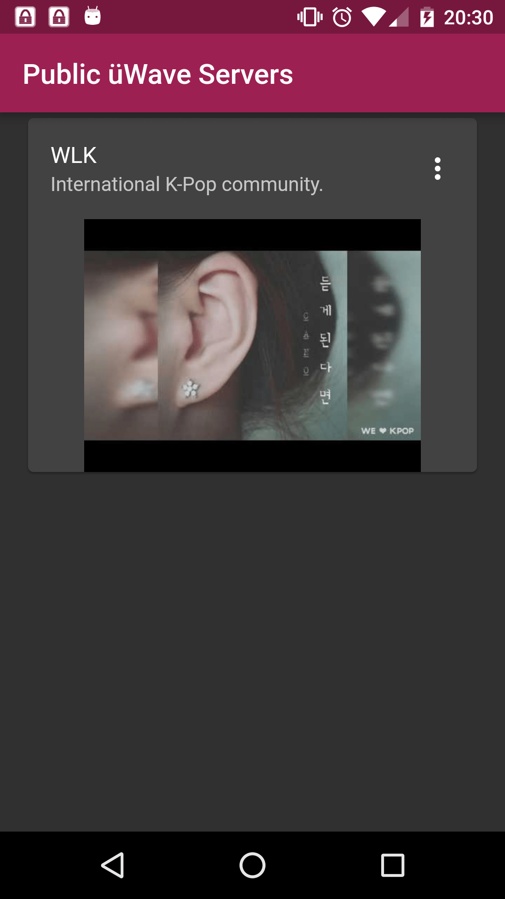

# üWave for Android

A [Flutter](https://flutter.io) and [NewPipe](https://newpipe.schabi.org) based client for [üWave](https://u-wave.net)!

|||
|-|-|
|  |  |

## Getting Started

First [install Flutter](https://flutter.io/get-started/install/).

Then, clone the repo:

```bash
git clone https://github.com/u-wave/flutter.git u-wave-flutter
cd u-wave-flutter
```

Connect your phone using USB debugging. Then you can run the app:

```bash
flutter run
```

## License

[GPL-3.0](./LICENSE.md)
